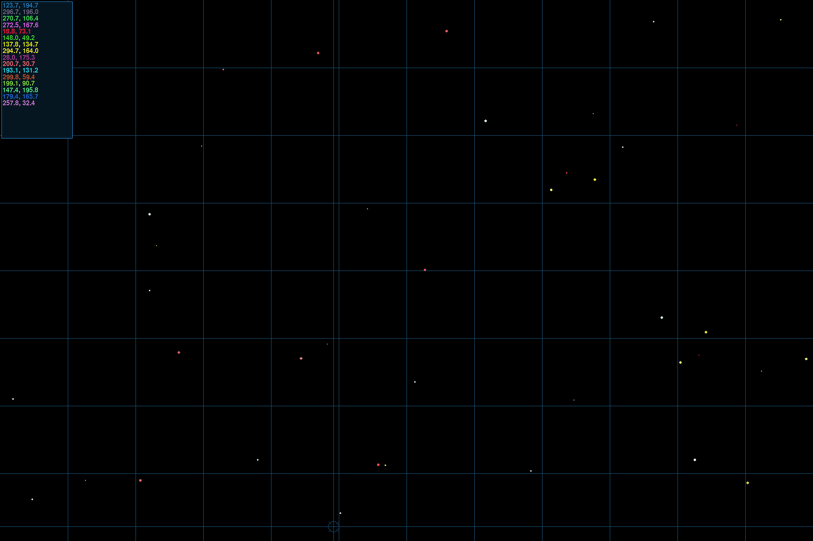

# StarField
A Python/PyGame application to display a pseudo random star field and overlays that would be reminiscent of the computer screens in the background on a space ship in a low budget sci-fi movie

# Running
Before first run make use of pip to install PyGame.
	pip install pygame

This was wrtting in Python 3.5.1 and made use of PyGame in 64bit Windows.

There is no reason it shoudn't work in 32bit.

On Windows it his high DPI aware and should scale nicely.

You can press 'Space' to regenerate the starfield on demand else it will happen every few seconds.

Press 'Escape' to quit

# Starfield
This is the main application that creates the starfield scanner.

It will render and update the scanner on the application loop.  The two are seperate so that second displays can be updating and switched to for drawing one at a time.

Press 1 -> 5 to control the active display.

Updates will continue in the background on all of them while not rendering.

# StarfieldScanner - 1
This will create 40 random stars every few seconds.
The Overlay consists of a targeting reticle, a grid and a text display of the current location and a history of the coordinates that the targeting reticle has been too.

Pressing the spacebar will cause the star field to be regenerated.

# Radar - 2
A 360 radar that is tracking targets and when the sweeping arm passes a blip animation with be played.

# Forward Sweep - 3
A forward facing radar sweep that is tracking the same targets but scaled to just be in the front quadrent. This arm swings left and right.

# Control Display - 4
An early progress of displaying gauges and dials that update over time.

# Ship - 5
A blue field with a grey ship marker. Pressing arrow keys to accelerate/decelerate and turn. The world wraps on each edge.
 
